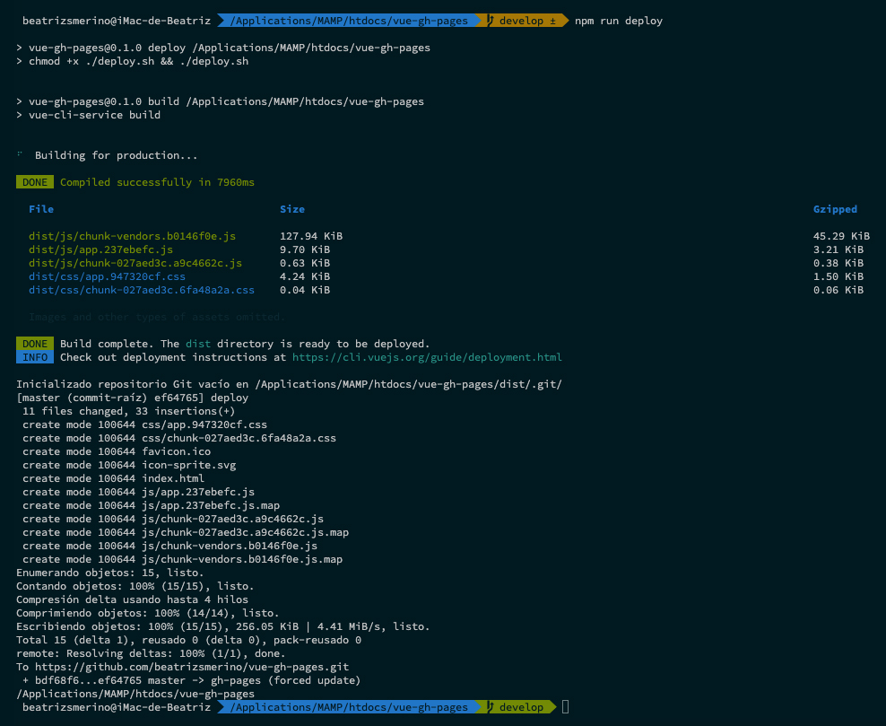

# 🔖 v1.x.x

## 🎯 Description

This version runs the `deploy-v1.sh` file using the npm `deploy:v1` script declared in the `package.json` file.

It does not require the installation of additional npm packages to work.

The process consists of pushing manually (only when we execute the `npm run deploy:v1` command in the terminal) the updates from the `master` branch to the `gh-pages` branch of a `git` repository uploaded to GitHub.

During the execution process you can see in the terminal what files it builds and where it publishes them.

To use it you need to customize some data. Change the `<USER_NAME>` and `<REPO_NAME>` variables in the files to your user name of GitHub account and repository name:

1. In the `vue.config.js` file you need to modify the repository name in the `pathPublic` property.
2. In the `deploy-v1.sh` file you need to modify the user name and repository name in the path of the `git` command.

## ⚙️ How it works

### 1️⃣ The `.gitignore` file

1.1. In the root of the project, there is a file called `.gitignore`, which was created when creating the [vue app](https://cli.vuejs.org/guide/creating-a-project.html), if not create it with the next command:

```bash
touch .gitignore
```

1.2. It is important that the `.gitignore` file includes the `dist` folder, which will be created when building the project for production.

```bash
.DS_Store
node_modules
/dist
```

### 2️⃣ The `vue.config.js` file

2.1. In the root of the project, there is also a `vue.config.js` file, if not create it with the next command:

```bash
touch vue.config.js
```

2.2. Inside of the `vue.config.js` file paste the next code:

```javascript
module.exports = {
	publicPath: process.env.NODE_ENV === 'production' ? '/<REPO_NAME>/' : '/'
};
```

2.3. In the previous code, update the [`publicPath`](https://cli.vuejs.org/config/#publicpath) changing the `<REPO_NAME>` variable for the name of the repository where the application will be deployed.

### 3️⃣ The `deploy-v1.sh` file

3.1. In the root of the project create the `deploy-v1.sh` file:

```bash
touch deploy-v1.sh
```

3.2. Inside of the `deploy-v1.sh` file paste the next code:

```bash
#!/usr/bin/env sh

# Abort on errors
set -e

# Build the files for production
npm run build

# Navigate into the build output directory
cd dist

# Inizialize git repository
git init

# Add all files to the repository
git add -A

# Commit the changes
git commit -m 'deploy'

# Push the new files to the remote repository if you are deploying to github.io
git push -f https://github.com/<USER_NAME>/<REPO_NAME>.git master:gh-pages

# Return to the previous directory
cd -
```

The `bash` script built in the `deploy-v1.sh` file is executed at the root of the project, it contains the serial execution of the commands necessary for the project release:

1.  `#!/usr/bin/env sh`: Run the next `shell` script writted in the `bash` language.
2.  `set -e`: Abort the execution if there are errors.
3.  `npm run build`: Build the files for production, this creates the `dist` folder.
4.  `cd dist`: Navigate into the `dist` folder, the output directory.
5.  `git init`: Inizialize a new empty Git repository.
6.  `git add`: Add all folders and files to the `staging area` of the new git repository.
7.  `git commit`: Create the first commit with the changes and the `deploy` message in the `master` branch of this new repository.
8.  `git push`: Pushes the changes from the `master` branch of the new repository to the `gh-pages` branch, which is automatically created, if it does not exist, in our main repository.
9.  `cd -`: Return to the previous directory.

The name `GitHub Pages` originates from the name of the `gh-pages` branch, where the deployment version of the project is located.

3.3. Replace the word `<USER_NAME>` with your GitHub username and `<REPO_NAME>` with the name of your repository.

The **last git command** must be replaced with any the next commands:

-   If you are deploying to `https://<USER_NAME>.github.io/<REPO_NAME>`.

```bash
git push -f https://github.com/<USER_NAME>/<REPO_NAME>.git master:gh-pages
```

-   If you do have your GitHub account configured to connect via SSH.

```bash
git push -f git@github.com:<USER_NAME>/<REPO_NAME>.git master:gh-pages
```

### 4️⃣ The `package.json` file

4.1. Create the next npm script inside of `package.json` file:

```json
"scripts": {
	"deploy:v1": "chmod +x ./deploy-v1.sh && ./deploy-v1.sh"
}
```

The script executes 2 commands, one after the other:

1. `chmod +x deploy-v1.sh`: Assign the execution permission in the root of the project.
2. `./deploy-v1.sh`: Execute the `deploy-v1.sh` file with `node`.

### 5️⃣ Deploy the application

5.1. Finally, you can deploy the application by running the `npm run deploy:v1` command with the terminal while in the root of the project.



5.2. To see the result, wait for the execution of the script to finish and open the application in the browser:

Use the next link replacing the `<USER_NAME>` and `<REPO_NAME>` variables with your data.

```bash
https://<USER_NAME>.github.io/<REPO_NAME>/
```

Here I leave you the example of mine:
[https://beatrizsmerino.github.io/vue-gh-pages/](https://beatrizsmerino.github.io/vue-gh-pages/)
