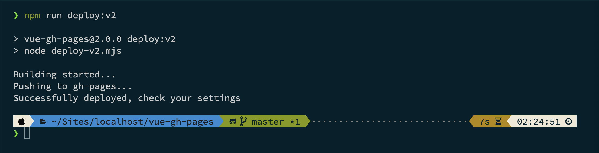

# 🔖 v2.x.x

## 🎯 Description

This version executes the `deploy-v2.mjs` file using the `npm run deploy:v2` command specified in the `package.json` file.

In contrast to the previous version, it has been developed in JavaScript, although `shell` scripts in `bash` language are still used within it. The NPM script command has been improved; now it is simpler, **there is no need to enable the execution permissions** in the root of the project before executing the JS file with Node.

The choice of the **file extension** `.mjs` or `.cjs` instead of the traditional `.js` is related to the use of **ECMAScript** modules. The `.mjs` extension indicates that the file is using **ESModules** syntax, which allows for better compatibility with modern JavaScript features. It's a convention to differentiate files that use **ESModules** from the ones using **CommonJS** modules. This distinction can be crucial, especially when working in an environment that supports both module systems, as is the case in this project.

This JavaScript file **depends on additional NPM packages to work** (`execa`, `chalk`, `node-emoji`, `fs`), which may be considered inconvenient.

However, the advantage of this version is that you only need to **customize one data in one file to be able to use it**. In the `vue.config.js` file, you need to change the `<REPO_NAME>` variable to match the repository name of your GitHub account.

The process is the same as in version `1.x.x`; it involves **manually pushing updates** from the `master` branch to the `gh-pages` branch of a `git` repository uploaded to GitHub.

Throughout the execution process, the terminal displays a **minimal information**, since it is not specified which files are extracted, their weight and subsequent compression. However you have the possibility to customize the messages created with `console.log` using colors and emojis to indicate their start, push, and successful or unsuccessful completion.

## ⚙️ How it works

In this version, points 1️⃣, 2️⃣ and 5️⃣ can be omitted; they work exactly the same as in version `1.x.x`.

### 0️⃣ Required NPM packages

Before diving into the deployment process with the `deploy` file, it's crucial to install the following NPM packages that enhance the functionality and user experience:

- The [`execa`](https://www.npmjs.com/package/execa) package allows the execution of `shell` scripts directly from a JavaScript file. It provides an easy way to execute commands in a cross-platform manner, making it an essential tool for smooth script execution within `Node.js` applications.
- The [`chalk`](https://www.npmjs.com/package/chalk) package adds a touch of color to your terminal output, making it visually appealing and easier to interpret. This package enables the creation of colored text, allowing you to convey information more clearly during the deployment process.
- The [`node-emoji`](https://www.npmjs.com/package/node-emoji) package allows the inclusion of emojis in your logs. This package provides a nice way to express messages or status updates, making the deployment experience more engaging.

```bash
npm install execa chalk node-emoji --save
```

There are also other packages that are required but do not need to be installed:

- The [`fs`](https://nodejs.org/api/fs.html) package facilitates file system interaction, ensuring compatibility across multiple operating systems. It does not need to be installed as a dependency in the `package.json` file, as it is included with Node.js, so it can be accessed if you have Node installed globally on your computer.

### 1️⃣ The `.gitignore` file

1.1. In the root of the project, there is a file called `.gitignore`, which was created when creating the [Vue app](https://cli.vuejs.org/guide/creating-a-project.html). If it doesn't exist, create it with the following command:

```bash
touch .gitignore
```

1.2. It is important that the `.gitignore` file includes the `dist` folder, which will be created when building the project for production.

```bash
.DS_Store
node_modules
/dist
```

### 2️⃣ The `vue.config.js` file

2.1. In the root of the project, there is the `vue.config.js` file, also created by Vue. If it doesn't exist, create it with the following command:

```bash
touch vue.config.js
```

2.2. Inside the `vue.config.js` file, paste the following code:

```javascript
module.exports = {
	publicPath: process.env.NODE_ENV === "production" ? "/<REPO_NAME>/" : "/"
};
```

2.3. In the previous code, update the [`publicPath`](https://cli.vuejs.org/config/#publicpath) by replacing the `<REPO_NAME>` variable with the name of the repository where the application will be deployed.

### 3️⃣ The `deploy-v2.mjs` file

3.1. In the root of the project, create the `deploy-v2.mjs` file:

```bash
touch deploy-v2.mjs
```

3.2. Inside the `deploy-v2.mjs` file, you can use two ways to deploy depending on the number of packages you want to install, so choose one of them, and copy and paste the following code:

1. Installing only the `execa` and `fs` packages, you get simple text messages on the terminal.
```javascript
const execa = require("execa");
const fs = require("fs");

(async () => {
	try {
		await execa("git", ["checkout", "--orphan", "gh-pages"]);

		console.log("Building started...");
		await execa("npm", ["run", "build"]);

		const folderName = fs.existsSync("dist") ? "dist" : "build";
		await execa("git", ["--work-tree", folderName, "add", "--all"]);

		await execa("git", ["--work-tree", folderName, "commit", "-m", "ci(deploy): build files for production in the dist folder"]);

		console.log("Pushing to gh-pages...");
		await execa("git", ["push", "origin", "HEAD:gh-pages", "--force"]);

		await execa("rm", ["-r", folderName]);

		await execa("git", ["checkout", "-f", "master"]);

		await execa("git", ["branch", "-D", "gh-pages"]);

		console.log("Successfully deployed, check your settings");
	} catch (e) {
		console.log(e.message);
		process.exit(1);
	}
})();
```

2. Installing the `execa`, `fs`, `chalk` and `node-emoji` packages you can improve the display and user experience by using colors and emojis in terminal messages.
```javascript
import { execa } from "execa";
import * as emoji from "node-emoji";
import chalk from "chalk";
import * as fs from "fs";

const iconArrows = emoji.get("fast_forward");
const iconRocket = emoji.get("rocket");

(async () => {
	try {
		await execa("git", ["checkout", "--orphan", "gh-pages"]);

		console.log(`${iconArrows} ${chalk.yellow("Building started...")}`);
		await execa("npm", ["run", "build"]);

		const folderName = fs.existsSync("dist") ? "dist" : "build";
		await execa("git", ["--work-tree", folderName, "add", "--all"]);

		await execa("git", ["--work-tree", folderName, "commit", "-m", "ci(deploy): build files for production in the dist folder"]);

		console.log(`${iconArrows} ${chalk.yellow("Pushing to gh-pages...")}`);
		await execa("git", ["push", "origin", "HEAD:gh-pages", "--force"]);

		await execa("rm", ["-r", folderName]);

		await execa("git", ["checkout", "-f", "master"]);

		await execa("git", ["branch", "-D", "gh-pages"]);

		console.log(`${iconRocket} ${chalk.green("Successfully deployed")}`);
	} catch (e) {
		console.log(e.message);
		process.exit(1);
	}
})();
```

The `JavaScript` script built in the `deploy-v2.mjs` file is executed at the root of the project. It contains the serial execution of the commands necessary for the project release:

1. `git checkout --orphan gh-pages`: Creates a new branch named `gh-pages`.
2. `npm run build`: Builds the files for production.
3. `folderName`: If the `dist` folder exists, it is used; otherwise, the `build` folder is used.
4. `git --work-tree folderName add --all`: Adds all files to the new branch.
5. `git --work-tree folderName commit -m "ci(deploy): build files for production in the dist folder"`: Commits the new branch.
6. `git push origin HEAD:gh-pages --force`: Pushes the new branch to the `gh-pages` branch of the repository.
7. `rm -r folderName`: Removes the `dist` folder.
8. `git checkout -f master`: Switches back to the `master` branch.
9. `git branch -D gh-pages`: Deletes the `gh-pages` branch.

### 4️⃣ The `package.json` file

4.1. Create the following NPM script inside the `package.json` file:

```json
"scripts": {
	"deploy:v2": "node deploy-v2.mjs"
}
```

The script executes 1 command:

1. `node deploy-v2.mjs`: Execute the `deploy-v2.mjs` file using `node`.

### 5️⃣ Deploy the application

5.1. Finally, you can deploy the application by running the `npm run deploy:v2` command in the terminal while in the root of the project.

There are two terminal outputs depending on the packages you use:

1. Using the `execa` and `fs` packages.  
It has a simple text messages that you can customize in the each `console.log` of the `deploy-v2.mjs` file.


2. Or using the `execa`, `fs`, `chalk` and `node-emoji` packages.  
It is simmilar to the first way but the output messages include texts with colors and emoji characters. So the inclusion of the additional packages `chalk` and `node-emoji`, can enhance the visual output, making it more friendly and easier to read.


5.2. To see the result, wait for the script execution to finish and open the application in the browser:

Use the following link, replacing the `<USER_NAME>` and `<REPO_NAME>` variables with your data.

```bash
https://<USER_NAME>.github.io/<REPO_NAME>/
```

Here is an example of mine: [https://beatrizsmerino.github.io/vue-gh-pages/](https://beatrizsmerino.github.io/vue-gh-pages/)
