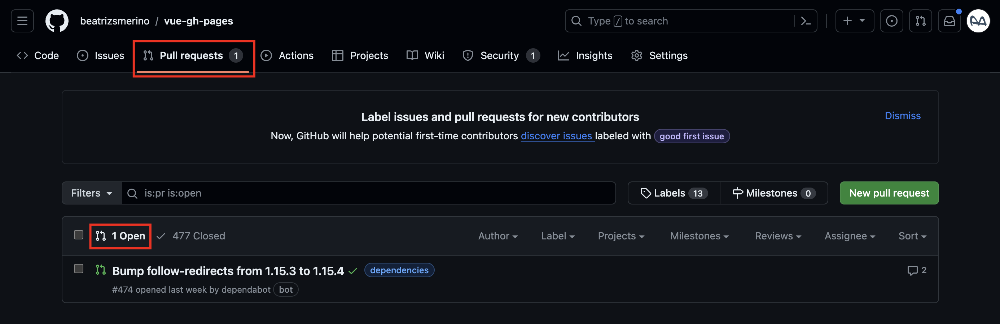

# 🔖 v3.x.x

## 🎯 Description

This version, based on the v2.x.x, executes the `deploy-v2.mjs` file using the `npm run deploy:v2` command specified in the `package.json` file.

It does **not require the installation of additional NPM packages** specific to the deployment process, except for those already used in v2.x.x.
But note, that the new `.github/workflows/deploy.yml` file that we will create in this version, uses `actions/checkout` and `actions/setup-node` to make it work.

In this version, you'll need to **customize some data** in the `vue.config.js` and `.github/workflows/deploy.yml` files, changing the `<USER_NAME>`, `<USER_EMAIL>` and `<REPO_NAME>` variables to match the username, the user email and repository name of your GitHub account.

The process still uses the script from the previous version, but incorporates **automatic deployment** via `GitHub Actions`, which is a significant shift towards automation and CI/CD (Continuous Integration & Continuous Deployment) best practices.
The process works as follows: when some changes are pushed to the `master` branch, the `.github/workflows/deploy.yml` workflow is executed, which automatically performs certain steps to upload the changes from the `dist` folder to the `gh-pages` branch of a `git` repository uploaded to GitHub.

This process **will no longer be seen in the terminal** so you will have to go to the github website, search for your repository and watch each step in the `Actions` tab to see if it finishes correctly.

In this documentation, in addition to detailing how to use `Github Actions` to automate the `Deployment workflow` in the file `.github/workflows/deploy.yml`, I will describe how to build the `Dependabot configuration` in the `.github/dependabot.yml` file and the `Node workflow` in the `.github/workflows/node.yml` file.

## ⚙️ How it works

Begin by following the steps outlined in the [README-v2.md](./README-v2.md) file. This includes the installation of the required packages, the creation of the files and their configuration.
Then return to this version to follow the instructions below.

You should know that the following steps 1️⃣ and 2️⃣ are a recommendation to enhance your configuration, they are not required for the deployment, so you can go to step 3️⃣ directely.

### 1️⃣ Github Actions. Dependabot configuration

#### 1.1. Create new file

In the root of the project, there is a file called `.github/dependabot.yml`. If it doesn't exist, create it with the following command:

```bash
mkdir -p .github && touch .github/dependabot.yml
```

Note: The `-p` or `--parents` option of the `mkdir` command will help you create the directory only if it does not already exist.

#### 1.2. Copy & Paste code

Inside the `dependabot.yml` file, paste the following code:

```yml
# For more information see: https://help.github.com/github/administering-a-repository/configuration-options-for-dependency-updates

version: 2
updates:
  - package-ecosystem: "npm"
    directory: "/"
    schedule:
      interval: "monthly"
      day: "saturday"
      time: "09:00"
      timezone: "Europe/Madrid"
    reviewers:
      - <USER_NAME>
    assignees:
      - <USER_NAME>
    commit-message:
      prefix: build
      prefix-development: build
      include: scope
    ignore:
      - dependency-name: "*"
        update-types: ["version-update:semver-major"]
    open-pull-requests-limit: 10
  - package-ecosystem: github-actions
    directory: "/"
    schedule:
      interval: "monthly"
      day: "saturday"
      time: "09:00"
      timezone: "Europe/Madrid"
    reviewers:
      - <USER_NAME>
    assignees:
      - <USER_NAME>
    commit-message:
      prefix: build
      prefix-development: build
      include: scope
    ignore:
      - dependency-name: "*"
        update-types: ["version-update:semver-major"]
    open-pull-requests-limit: 10
```

#### 1.3. Explain the code

In the above code, the configuration specifies how `Dependabot` looks for dependency updates and creates Pull Requests (PR) for them:

1. `package-ecosystem`: Specifies the environment of the dependencies to update (e.g., `npm` for Node.js packages, `github-actions` for GitHub Actions).
2. `directory`: Indicates the main location of the dependencies (e.g., `package.json` and `package-lock.json` files for NPM and `.github` folder for GitHub Actions).
3. `schedule`: Defines when Dependabot checks for updates. It includes the `interval` (how often), `day` of the week, `time`, and `timezone`.
4. `assignees` and `reviewers`: Add the GitHub usernames of the people who will be assigned to manage and review the Pull Requests created. The `assignees` user takes the necessary steps for conflict resolution and the `reviewers` user reviews the proposed changes, approving them or requesting new changes. Both can leave feedback on the process, but it is important to note that the actual permissions to merge PRs depend on the user's roles and access rights within the GitHub repository. Only users with the appropriate access levels (such as `maintainers` or `administrators`) can merge the PR into the repository.
5. `commit-message`: Sets the format for the commit messages Dependabot will use. Include a `prefix` for when the change affects fixes, `prefix-development` for when the change affects development, and use `include` to indicate if the scope should be included. This helps maintain consistency and readability in your repository's commit history.
6. `ignore`: Allows to ignore dependencies and versions, which should not be automatically updated, preventing a PR to be created for them. For example, major version upgrades.
7. `open-pull-requests-limit`: Defines the maximum number of Pull Requests Dependabot will create. Once this limit is reached, it will stop creating new ones until some are merged or closed.

#### 1.4. Customize data

You can configure the rest of the options if you wish, but for this file to work, the most important thing is to update the `reviewers` and `assignees` by replacing the `<USER_NAME>` variable with the username of the person responsible for reviewing and merging Dependabot Pull Requests.

```yml
	reviewers:
      - <USER_NAME>
    assignees:
      - <USER_NAME>
```

```yml
	reviewers:
      - beatrizsmerino
    assignees:
      - beatrizsmerino
```

#### 1.5. How execute the workflow and watch the results

So this configuration is expected to work like this:

1. Dependabot is configured in the `.github/dependabot.yml` file, so the first thing it will do is to routinely monitor your project's dependencies. Specifically, on the first Saturday of each month at 09:00 (Madrid time), it will scan your project for any updates needed for your dependencies. This includes both your Node.js packages (`npm`) and your GitHub Actions workflows (`github-actions`).
2. Then, when updates are found, Dependabot will automatically create Pull Requests, which will follow the specified confirmation message format and have one or more specific users assigned to solve it, review it and, if they have permissions, merge it with the `master` branch.  
On the Github website where the repository is uploaded, inside the `Pull Request` section ([https://github.com/beatrizsmerino/vue-gh-pages/pulls](https://github.com/beatrizsmerino/vue-gh-pages/pulls)) you can see a list of them.
3. After choosing a PR ([https://github.com/beatrizsmerino/vue-gh-pages/pull/478](https://github.com/beatrizsmerino/vue-gh-pages/pull/478)), the user assigned as `assignees` will be in charge of correcting the possible errors that prevent its merging.  
Once everything is correct, the user assigned as `reviewer`, will go to the `Modified files` tab ([https://github.com/beatrizsmerino/vue-gh-pages/pull/478/files](https://github.com/beatrizsmerino/vue-gh-pages/pull/478/files)), mark each file as `viewed`, click on the `Review changes` button and check the `Approve` option.  
Finally a user with permissions, will go at the end of the main page of the PR ([https://github.com/beatrizsmerino/vue-gh-pages/pull/478](https://github.com/beatrizsmerino/vue-gh-pages/pull/478)) to close it by merging the changes with the `master` branch.




#### 1.6. Manual execution of the workflow

If for some reason, you want to force the execution of the `.github/dependabot.yml` file instead of waiting for its execution, you can do it in the following way:

1. First, access the `Insights` tab in your repository interface.
2. Select the `Dependency graph` option located in the left menu.
3. Then, go to the `Dependabot` tab.
4. Click on the `Recent update jobs` link.
5. Finally, click on the `Check for updates` button to start the update.


### 2️⃣ Github Actions. Workflow Node

#### 2.1. Create new file

In the root of the project, there is a file called `.github/workflows/node.yml`. If it doesn't exist, create it with the following command:

```bash
mkdir -p .github/workflows && touch node.yml
```

#### 2.2. Copy & Paste code

Inside the `node.yml` file, paste the following code:

```yml
# For more information see: https://help.github.com/actions/language-and-framework-guides/using-nodejs-with-github-actions

name: 🚀 Check project in different Node versions
on:
  push:
    branches: [ master ]
  pull_request:
    branches: [ master ]
jobs:
  check-node-build:
    name: 🧩 Build, test and validate code
    runs-on: ubuntu-latest
    strategy:
      matrix:
        node-version: [16, 18, 20]
    steps:
    - name: 🔀 Checkout code from repository
      uses: actions/checkout@v4
    - name: 🛠️ Setup Node version ${{ matrix.node-version }}
      uses: actions/setup-node@v4
      with:
        node-version: ${{ matrix.node-version }}
    - name: 📦 Install dependencies
      run: npm install
    - name: 🏗️ Run NPM script to build
      run: npm run build --if-present
    - name: 🧪 Run NPM script to test
      run: npm test --if-present
    - name: 🔍 Validate commits to use the commitlint syntax
      run: npx commitlint --from ${{ github.event.pull_request.base.sha }} --to ${{ github.event.pull_request.head.sha }} --verbose
```

#### 2.3. Explain the code

This GitHub Actions workflow is an integral part of maintaining a robust and compatible `Node.js` project, ensuring that every change is automatically tested and validated across different environments:

1. `🔀 Checkout code from repository`: Clones your project repository into the GitHub Actions runtime environment (runner), providing access to its codebase.
2. `🛠️ Setup Node version x.x`: Specifies Node.js versions (16.x, 18.x, 20.x) to be checked to ensure compatibility between various versions.
3. `📦 Install Dependencies`: Runs `npm install` command to install all the necessary dependencies defined in your `package.json`.
4. `🏗️ Run NPM script to build`: Run the `npm run build` command, if present, to compile your project and prepare it for testing.
5. `🧪 Run NPM script to test`: Conducts automated tests by running `npm test` command if exist, ensuring that the code works as expected.
6. `🔍 Validate commits to use the commitlint syntax`: Ensures that all commit messages in the pull request adhere to the predefined standards of commitlint, maintaining a clean and consistent commit history.

#### 2.4. How execute the workflow and watch the results

So this configuration is expected to work like this:

1. This GitHub Actions workflow in Node.js, defined in `.github/workflows/node.yml` file, will be automatically triggered by any `push` to the `master` branch or when a Pull Request is opened against it. This includes instances where Dependabot generates PRs for dependencies updates.  
2. When the workflow auto-runs you will have to make some checks such as that all dependencies are installed correctly, that the project can be built for production and that it passes all tests.
This verification is particularly crucial in scenarios where a dependency may work with one version of Node but not another. For example, `node-emoji@2.1.3` is only compatible with Node versions >=18.  
The workflow rigorously checks that these updates are compatible and do not introduce problems or break code, before the merge, ensuring that each change maintains the integrity and functionality of the project.
3. During his execution, upon detection of any issues, such as failed tests or incompatible code, the workflow halts the integration process, signaling the need for intervention.  
Contributors are then notified of the failed status of the process via an alert on GitHub and also by email. And they have to swiftly identify the cause of the failure thanks to detailed logs accessible on the `Actions` tab ([https://github.com/beatrizsmerino/vue-gh-pages/actions/runs/7578245898/job/20640527864#step:4:136](https://github.com/beatrizsmerino/vue-gh-pages/actions/runs/7578245898/job/20640527864#step:4:136)).  
Finally, once the developers resolve the issues and upload the changes, the workflow runs again to confirm that the changes are safe to merge with the `master` branch this time.


This process can also be forced in the same way as described in the `Dependabot` process. Go [here](#16-manual-execution-of-the-workflow) to read the steps.

### 3️⃣ Github Actions. Workflow deploy

#### 3.1. Create new file

In the root of the project, there is a file called `.github/workflows/deploy.yml`. If it doesn't exist, create it with the following command:

```bash
mkdir -p .github/workflows && touch deploy.yml
```

#### 3.2. Copy & Paste code

Inside the `deploy.yml` file, paste the following code:

```yml
# For more information see: https://github.com/beatrizsmerino/vue-gh-pages

name: 🚀 Project deployment in GitHub Pages
on:
  push:
    branches: [ master ]
jobs:
  gh-pages-deploy:
    name: 🧩 Deploying code to gh-pages branch
    runs-on: ubuntu-latest
    steps:
      - name: 🔀 Checkout code from repository
        uses: actions/checkout@v4
      - name: 🛠️ Setup Node version
        uses: actions/setup-node@v4
        with:
          node-version: 20.x
      - name: 📦 Install dependencies
        run: npm ci
      - name: 🙍‍♂️ Setup git user
        run: |
          git config user.name <USER_NAME>
          git config user.email <USER_EMAIL>
      - name: 🏗️ Run NPM script to deploy
        run: npm run deploy:v2
```

#### 3.3. Explain the code

This GitHub Actions workflow is designed to streamline the deployment of your project to `GitHub Pages` automatically every time a contributor uploads new changes, reflecting changes in real time:

1. `🔀 Checkout code from repository`: Retrieve the code from your repository, cloning it into the GitHub Actions runner and making it available to the workflow.
2. `🛠️ Setup Node version`: Prepares the GitHub Actions runner with Node.js version 20.x, to ensure compatibility with your project's Node.js version requirements.
3. `📦 Install dependencies`: Executes `npm ci` command for a clean install of your project's dependencies, ensuring a consistent environment for the deployment.
4. `🙍‍♂️ Setup git user`: Sets up Git with your name and email, to associate your identity with the commits made during the deployment process.
5. `🏗️ Run NPM script to deploy`: Runs the `npm run deploy:v2` command defined in your `package.json`, which triggers the script of `deploy-v2.mjs` file, for building and deploying your project to the `gh-pages` branch.

#### 3.4. Customize data

In this file it is necessary to update the values of `user.name` and `user.email` replacing the variables `<USER_NAME>` and `<USER_EMAIL>` with the name and email of the GitHub account that will make sure to deploy the repository.

```yml
      - name: 🙍‍♂️ Setup git user
        run: |
          git config user.name <USER_NAME>
          git config user.email <USER_EMAIL>
```

```yml
      - name: 🙍‍♂️ Setup git user
        run: |
          git config user.name "Beatriz Sopeña Merino"
          git config user.email "beatrizsmerino@gmail.com"
```


#### 3.5. How execute the workflow and watch the results

So this configuration is expected to work like this:

1. This GitHub Actions workflow of Deployment is defined in `.github/workflows/deploy.yml` file.  
Therefore, to deploy the application, simply `push` your changes to the `master` branch, this action will automatically trigger this deployment workflow.
2. Then, you can track the progress of the deployment by visiting your repository's GitHub page. Navigate to the `Actions` tab to see the workflow in real-time ([https://github.com/beatrizsmerino/vue-gh-pages/actions/runs/7596714083](https://github.com/beatrizsmerino/vue-gh-pages/actions/runs/7596714083)). There you'll find detailed logs and status updates for each step of the deployment process, allowing you to monitor and verify the successful deployment of your application.
3. Finally, to see the result, wait for the script to finish executing and open the application in the browser. Use the following link, replacing the `<USER_NAME>` and `<REPO_NAME>` variables with your data to see your published project.

```bash
https://<USER_NAME>.github.io/<REPO_NAME>/
```

Here is an example of mine: [https://beatrizsmerino.github.io/vue-gh-pages/](https://beatrizsmerino.github.io/vue-gh-pages/)


