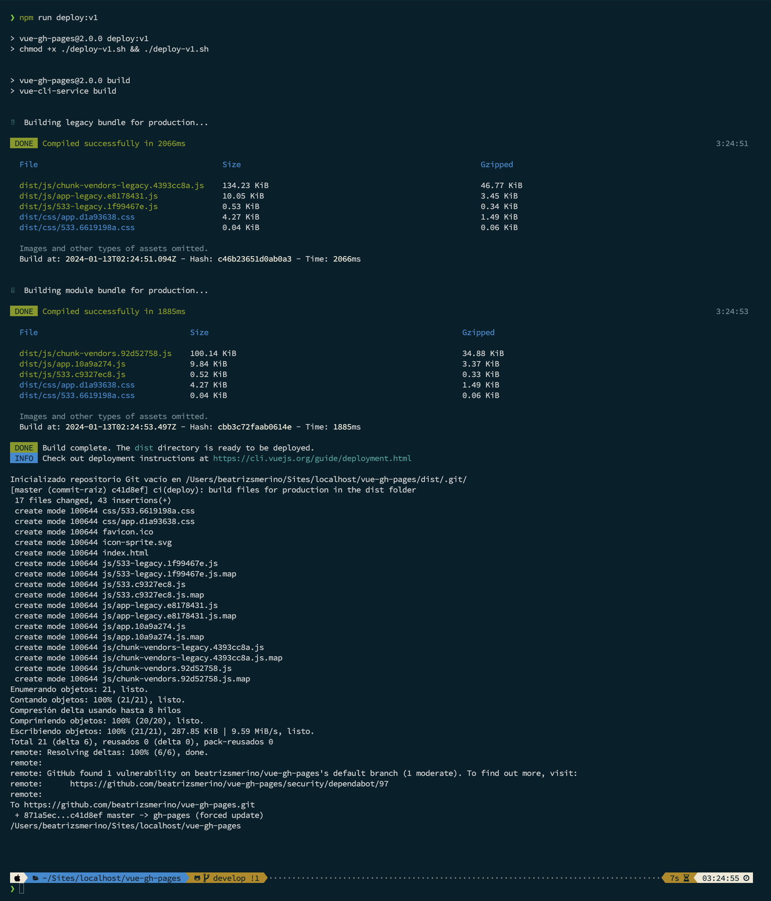

# Deploy a Vue app to GitHub Pages


> This repository has been created with the idea of serving as a tutorial to publish a public repository on the `github.io` domain using GitHub Pages.

**GitHub Pages** is a free service that provides a simple way to host your own website about yourself, your organization, or your project. It takes `HTML`, `CSS` and `JavaScript` files directly from a repository on GitHub, optionally runs the files through a build process, and publishes a website. It is therefore a static site hosting service and **does not support server-side code** such as `PHP`, `Ruby` or `Python`.

For more information, see:

-   "[About GitHub Pages](https://docs.github.com/en/pages/getting-started-with-github-pages/about-github-pages)": To learn about the different types of GitHub Pages sites.

-   "[Changing the visibility of your GitHub Pages site](https://docs.github.com/en/pages/getting-started-with-github-pages/changing-the-visibility-of-your-github-pages-site)": You can manage access control by publishing the site as public or private.

-   "[Using a custom domain with GitHub Pages](https://docs.github.com/en/articles/using-a-custom-domain-with-github-pages)": You can host your site on GitHub's `github.io` domain or on your own custom domain.

-   "[Creating a GitHub Pages site](https://docs.github.com/en/pages/getting-started-with-github-pages/about-github-pages)": To start, you need to **enable the service of GitHub Pages** in your Github repository.

# ⚙️ How it works

## 1️⃣ . The `.gitignore` file

1.1. In the root of the project, there is a file called `.gitignore`, which was created when creating the [vue app](https://cli.vuejs.org/guide/creating-a-project.html), if not create it with the next command:

```bash
touch .gitignore
```

1.2. It is important that the `.gitignore` file includes the `dist` folder, which will be created when building the project for production.

```bash
.DS_Store
node_modules
/dist
```

## 2️⃣ . The `vue.config.js` file

2.1. In the root of the project, there is also a `vue.config.js` file, if not create it with the next command:

```bash
touch vue.config.js
```

2.2. Inside of the `vue.config.js` file paste the next code:

```javascript
module.exports = {
	publicPath: process.env.NODE_ENV === 'production' ? '/<REPO_NAME>/' : '/'
};
```

2.3. In the previous code, update the [`publicPath`](https://cli.vuejs.org/config/#publicpath) changing the `<REPO_NAME>` variable for the name of the repository where the application will be deployed.

## 3️⃣ . The `deploy.sh` file

3.1. In the root of the project create the `deploy.sh` file:

```bash
touch deploy.sh
```

3.2. Inside of the `deploy.sh` file paste the next code:

```bash
#!/usr/bin/env sh

# Abort on errors
set -e

# Build the files for production
npm run build

# Navigate into the build output directory
cd dist

# Inizialize git repository
git init

# Add all files to the repository
git add -A

# Commit the changes
git commit -m 'deploy'

# Push the new files to the remote repository if you are deploying to github.io
git push -f https://github.com/<USER_NAME>/<REPO_NAME>.git master:gh-pages

# Return to the previous directory
cd -
```

The `bash` script built in the `deploy.sh` file is executed at the root of the project, it contains the serial execution of the commands necessary for the project release:

1.  `#!/usr/bin/env sh`: Run the next `shell` script writted in the `bash` language.
2.  `set -e`: Abort the execution if there are errors.
3.  `npm run build`: Build the files for production, this creates the `dist` folder.
4.  `cd dist`: Navigate into the `dist` folder, the output directory.
5.  `git init`: Inizialize a new empty Git repository.
6.  `git add`: Add all folders and files to the `staging area` of the new git repository.
7.  `git commit`: Create the first commit with the changes and the `deploy` message in the `master` branch of this new repository.
8.  `git push`: Pushes the changes from the `master` branch of the new repository to the `gh-pages` branch, which is automatically created, if it does not exist, in our main repository.
9.  `cd -`: Return to the previous directory.

The name `GitHub Pages` originates from the name of the `gh-pages` branch, where the deployment version of the project is located.

3.3. Replace the word `<USER_NAME>` with your GitHub username and `<REPO_NAME>` with the name of your repository.

The **last git command** must be replaced with any the next commands:

-   If you are deploying to `https://<USER_NAME>.github.io/<REPO_NAME>`.

```bash
git push -f https://github.com/<USER_NAME>/<REPO_NAME>.git master:gh-pages
```

-   If you do have your GitHub account configured to connect via SSH.

```bash
git push -f git@github.com:<USER_NAME>/<REPO_NAME>.git master:gh-pages
```

## 4️⃣ . The `package.json` file

4.1. Create the next npm script inside of `package.json` file:

```json
"scripts": {
	"deploy": "chmod +x ./deploy.sh && ./deploy.sh"
}
```

The script executes 2 commands, one after the other:

1. `chmod +x deploy.sh`: Assign the execution permission in the root of the project.
2. `./deploy.sh`: Execute the `deploy.sh` file with `node`.

## 5️⃣ . Deploy the application

5.1. Finally, you can deploy the application by running the `npm run deploy` command with the terminal while in the root of the project.



5.2. To see the result, wait for the execution of the script to finish and open the application in the browser:

Use the next link replacing the `<USER_NAME>` and `<REPO_NAME>` variables with your data.

```
https://<USER_NAME>.github.io/<REPO_NAME>/
```

Here I leave you the example of mine:

### [https://beatrizsmerino.github.io/vue-gh-pages/](https://beatrizsmerino.github.io/vue-gh-pages/)

# 🚀 Project setup

## Install npm packages

```bash
npm install
```

## Create a Server for development (compiles and hot-reloads the code)

```bash
npm run serve
```

## Build the files for production (compile and minify the code)

```bash
npm run build
```

## Format the code (lints and fix bugs)

```bash
npm run lint
```

## Publish the code for production in GitHub Pages

```bash
npm run deploy
```

# 🧐 References

1.  🔖&nbsp; Title: [Deployment. Platform Guides. GitHub Pages. Pushing updates manually](https://cli.vuejs.org/guide/deployment.html#github-pages). Author: [Vue.js](https://cli.vuejs.org/). Website: Vue. Date: 2021

2.  🔖&nbsp; Title: [Cómo publicar una aplicación Vue en GitHub Pages](https://www.neoguias.com/como-publicar-aplicacion-vue-github-pages/). Author: [Edu Lázaro](https://www.neoguias.com/tutoriales/vue/). Website: Neoguias. Date: 2021

3.  🔖&nbsp; Title: [How I Use GitHub Actions to Auto-deploy my Vue.js Site to GitHub Pages](https://dev.to/juniordevforlife/how-i-use-github-actions-to-auto-deploy-my-vue-js-site-to-github-pages-49bf). Author: [Jason F](https://dev.to/juniordevforlife). Website: DEV. Date: 2021

4.  🔖&nbsp; Title: [Deploy to Github Pages like a pro with Github Actions](https://dev.to/rolanddoda/deploy-to-github-pages-like-a-pro-with-github-actions-4hdg#create-a-github-action-to-automate-deployment). Author: [Roland Doda](https://dev.to/rolanddoda). Website: DEV. Date: 2020

5.  🔖&nbsp; Title: [Deploying Vue Apps to Github Pages](https://medium.com/swlh/deploy-vue-app-to-github-pages-2ada48d7397e). Author: [Bobby Allen](https://medium.com/@protonbobby). Website: Medium. Date: 2020

6.  🔖&nbsp; Title: [vue-gh-pages](https://github.com/cristinafsanz/vue-gh-pages). Author: [Cristina Sanz](https://github.com/cristinafsanz). Website: GitHub. Date: 2017
